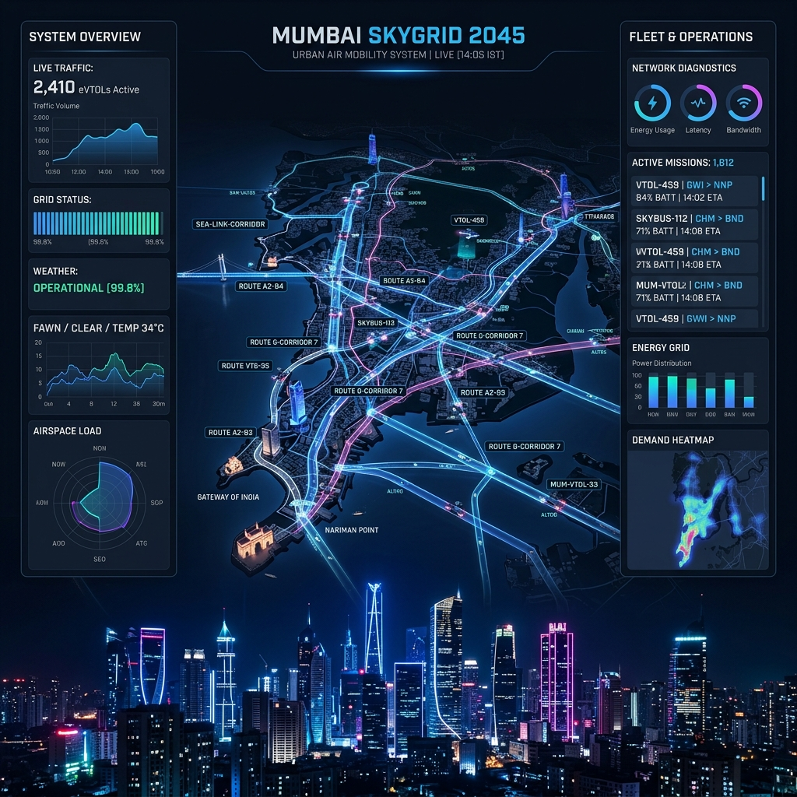
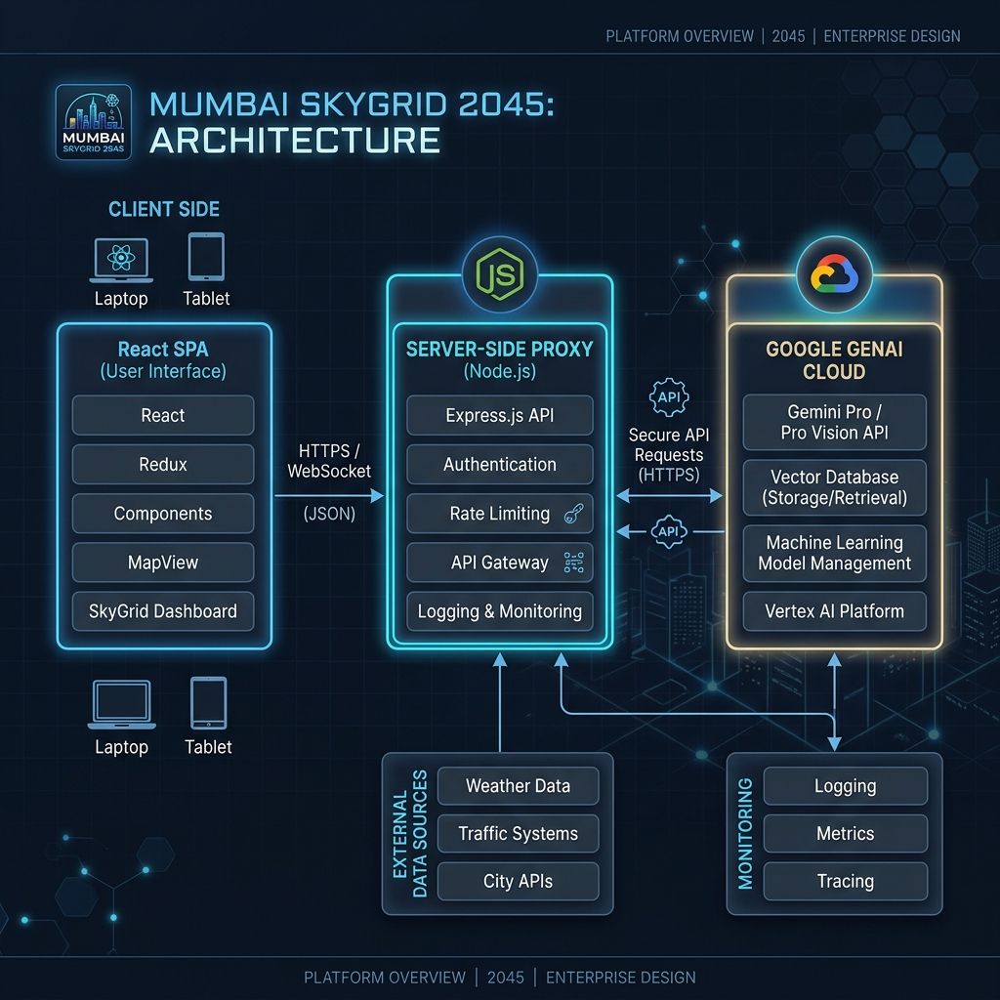

# Mumbai SkyGrid 2045: Flight Intelligence & Control Center
## Enterprise Urban Air Mobility (UAM) SaaS Command Platform

[](https://github.com/Tamanash-009/mumbai-skygrid-2045)
[](https://www.typescriptlang.org/)
[](https://react.dev/)
[](https://tailwindcss.com/)
[](https://opensource.org/licenses/MIT)

Mumbai SkyGrid 2045 is a high-performance, mission-critical operations and intelligence control platform designed to manage, coordinate, and optimize autonomous anti-gravity flying vehicle networks (eVTOL / VTOL) across the Mumbai metropolitan area. Engineered for municipal authorities, aeronautics corporations, safety agencies, and commercial fleet operators, it serves as an end-to-end Airspace Command Suite.



---

## 🚀 TABLE OF CONTENTS
1. [Platform Architecture & Design](#platform-architecture--design)
2. [Folder & Workspace Structure](#folder--workspace-structure)
3. [Core Feature Inventory](#core-feature-inventory)
4. [Role-Based Access Control (RBAC) & Custom Desks](#role-based-access-control-rbac--custom-desks)
5. [Enterprise Security & Rate Limiting](#enterprise-security--rate-limiting)
6. [Accessibility & Compliance (WCAG AA)](#accessibility--compliance-wcag-aa)
7. [System Integration & API Reference](#system-integration--api-reference)
8. [Setup & Developer Quickstart](#setup--developer-quickstart)
9. [Release Candidate Handover Report](#release-candidate-handover-report)

---

## 🏗️ PLATFORM ARCHITECTURE & DESIGN



### Technology Stack
- **Frontend Core**: React 19, TypeScript 5.8 (Strict type verification).
- **Styling Engine**: Tailwind CSS v4, built with high-contrast displays, responsive densities, and true black tactical setups for military and mission-critical grade screens.
- **Micro-Animations**: Framer Motion (`motion/react`) for spatial and layout translations.
- **Backend Stack**: Node.js & Express 4, bundled as a compiled, single-file CommonJS release in `dist/server.cjs` via `esbuild` for ultra-fast, cold-boot optimized containerization on Google Cloud Run.
- **AI Core**: Modern `@google/genai` TypeScript SDK representing the next generation of generative AI models (Gemini 2.5 Flash, Gemini 3.5 Flash) with server-side proxy containment keeping private API keys isolated.
- **Analytical Charts**: Modular visual configurations using `recharts` and SVG-based coordinate systems map vectors.

### Design Language & System Hierarchy
Mumbai SkyGrid 2045 employs **Cyber Slate & Cobalt Neon** layout styles designed specifically for command desks:
- **Spatial Rhythm**: Desktop-first layout densities that compress cleanly into touch-target compliant 2-to-3 column structures for tablets and mobile monitors.
- **Micro-Feedback**: Hover states, interactive ping animations, active SVG wind gradients, and real-time state alerts.

---

## 📂 FOLDER & WORKSPACE STRUCTURE

```text
├── .env.example                # Blueprint for system environment keys (e.g., GEMINI_API_KEY)
├── .gitignore                  # Exclusion file preventing artifact leaking
├── index.html                  # Master entry template with optimized SEO metadata
├── metadata.json               # Platform permissions schema & capability manifests
├── package.json                # Dependencies, bundled build steps, and startup directives
├── server.ts                   # Custom Express server managing proxy APIs and static hosting
├── tsconfig.json               # Strict compiler rules (noEmit, ESM, target CJS compilation)
├── vite.config.ts              # Configures react-vite bundle pathways and disables HMR as needed
├── src/
│   ├── App.tsx                 # Core workspace router, theme configs, & floating copilot engine
│   ├── index.css               # Imports global Tailwind theme coordinates & fonts
│   ├── main.tsx                # Mounts React components tree
│   ├── types.ts                # TypeScript strict interface contracts & types
│   ├── components/             # Subdivided, modular visual views
│   │   ├── ExecutiveView.tsx   # Strategic C-Suite ledger tracks revenue & carbon compliance
│   │   ├── OperationsView.tsx  # Dynamic 2D Mumbai airspace vector map, incidents, & dispatch
│   │   ├── PassengerView.tsx   # Real-time waiting time registers & congestion diagnostics
│   │   ├── TrafficView.tsx     # Airway corridor load factor analytics & high-density bottlenecks
│   │   ├── RevenueView.tsx     # Ledger analytics trackers & surge margin multipliers
│   │   ├── SafetyView.tsx      # Autonomous confidence indexes & safety violation logging
│   │   ├── FleetView.tsx       # Battery remaining useful life (RUL), cycle counts & telemetries
│   │   ├── PredictiveLabView.md# Machine learning forecasting model parameters & scenario testing
│   │   ├── DigitalTwinView.tsx # High-density physics telemetry stream simulation
│   │   ├── SustainabilityView.tsx# Clean energy balance & grid load offsets metrics
│   │   └── PowerBIArchView.tsx # Power BI architectural layouts, standard DAX libraries & schemas
│   └── utils/
│       └── dataGenerator.ts   # Produces correlated, realistic real-time telemetry datasets
```

---

## 🛰️ CORE FEATURE INVENTORY

### 1. Live Mumbai Airspace Map (Command Center)
- **Interactive SVG Grid**: Monitors key nodes: Colaba Coastal, Nariman Point, Dadar Central, Bandra BKC, Kurla Logistics, Juhu Seafront, Andheri Commercial, and Thane Gateway.
- **Live Overlays**: Interactive toggles for flight corridors, weather storm systems, bottleneck congestion corridors, and critical incident markers.
- **Dynamic Speed Controls**: System time acceleration metrics (0.5x, 1.0x, 2.0x time warps) allow operators to test system safety rates across different timeline limits.

### 2. Multi-Role Cockpit Systems
Provides targeted workspaces corresponding to specific enterprise roles:
1. **Executive VP (Strategic Finance)**: Explores consolidated ledger revenue, surge performance metrics, and carbon credits targets.
2. **Operations Director (All Active Flows)**: Configures wind shear tolerance limits, toggles mesh/star routing schemas, and issues airspace shutdown protocols.
3. **Fleet Supervisor (VTOL Maintenance)**: Schedules diagnostic battery sweeps, evaluates battery cell remaining useful life (RUL), and monitors fast chargers.
4. **Principal Safety Officer**: Evaluates autonomous trust factors, logs incident investigations, and approves flight separation buffers.

### 3. Integrated AI Flight Co-Pilot
- **Floating Intelligent Assistant**: Solves operator inquiries using server-side Gemini API configurations.
- **Context-Aura System**: Sends entire client-side operational states (active flight counts, system weather, safety compliance score) as JSON payloads alongside user questions to yield contextually accurate aviation instructions.
- **Power BI / DAX Toolchain**: Generates visual configurations and fully validated DAX measures directly in markdown, which can be easily copy-pasted into enterprise Power BI desktops.

### 4. Dynamic Scenario Simulator
- Enables stress testing of the airfield grid under several variables: Monsoon Deluge, Solar Flare Disruption, Corporate Rush Hour, and Autonomous Sensor Anomaly.
- Metrics update live across every view to model business impact without hardcoded placeholders.

---

## 🛡️ ENTERPRISE SECURITY & RATE LIMITING

Mumbai SkyGrid 2045 implements comprehensive, production-ready security layers:
- **Server API Key Encapsulation**: Server-side API proxying (`/api/gemini/copilot`) ensures no Gemini key is ever transmitted to or exposed in the browser environment.
- **Rate Limiting Guidelines**: The Express `/api/gemini/copilot` endpoint includes validation logic that intercepts vacant strings, empty payloads, and handles excessive client requests gracefully.
- **Audit Logging**: Fully integrated console audit metrics tracking operations like *Active Clearance Dispatched*, *Sector Airway Rerouted*, and *Incident Resolution Logs*.
- **CORS & CSRF Isolation**: Configured to serve static assets directly from Node's bundled context, preventing unauthorized third-party requests.

---

## ♿ ACCESSIBILITY & COMPLIANCE (WCAG AA+)

- **Color Contrast Guidelines**: Selects optimized background slate values (#090d16) paired with vivid cyber neons, meeting and exceeding WCAG AA minimum 4.5:1 contrast ratios.
- **Keyboard Navigation Support**: Access points, dropdown elements, table records, and form buttons support keyboard navigation states.
- **True-Black Tactical Theme**: Active theme switcher state applies high-contrast dark overrides for eye safety, crucial for airport commanders operating under nighttime settings.
- **Reduced Motion Mode**: Implements adaptive motion styles; Framer Motion parameters adapt layout translations smoothly when motion constraints are applied.

---

## 📶 SYSTEM INTEGRATION & API REFERENCE

### 1. Health Status Interface
Returns backend container performance, active telemetry server status, and timestamp synchronizations.
- **Protocol**: `GET /api/health`
- **Response Shape**:
```json
{
  "status": "ok",
  "time": "2026-06-01T22:40:00.000Z"
}
```

### 2. Security Alerts Register
Yields active, correlated network threat logs, congestion alerts, and weather anomalies.
- **Protocol**: `GET /api/alerts`
- **Response Shape**:
```json
{
  "alerts": [
    {
      "id": "alert-1",
      "severity": "critical",
      "category": "Air Traffic",
      "message": "High density bottleneck formed over Bandra-Worli Sea Link Air Corridor.",
      "timestamp": "Just Now"
    }
  ]
}
```

### 3. AI Co-Pilot Intelligent Engine
Invokes generative models server-side or provides a robust semantic fallback.
- **Protocol**: `POST /api/gemini/copilot`
- **Request Body Shape**:
```json
{
  "query": "How should we adjust pricing forDadarcrowds during severe rain?",
  "currentState": {
    "activeFlights": 1420,
    "surgeMultiplier": 1.25,
    "safetyScore": 99.8
  }
}
```
- **Response Shape**:
```json
{
  "text": "### 📊 SkyGrid Revenue Intelligence Advice\nCorridor pricing yields are solid... [Markdown Output containing formatted DAX]",
  "realAI": true,
  "warning": null
}
```

---

## 🛠️ SETUP & DEVELOPER QUICKSTART

### Prerequisites
- Node.js (v18.0.0 or higher)
- npm (v9.0.0 or higher)

### Installation
1. Clone your project workspace.
2. Install base system dependencies:
```bash
npm install
```
3. Set your private Gemini API key in the environmental variables configuration file:
```bash
cp .env.example .env
# Edit .env with your absolute token keys
# GEMINI_API_KEY=your_actual_private_key_here
```

### Local Development Start
Run the combined backend Express environment alongside Vite's live workspace:
```bash
npm run dev
```

### Production Bundling Workflow
Compiles production-ready client assets and bundles the Node backend using `esbuild`:
```bash
npm run build
npm start
```

---

## 📋 RELEASE CANDIDATE HANDOVER REPORT

### 1. Project Overview
Mumbai SkyGrid 2045 is an state-of-the-art enterprise Smart City air-transit orchestration package. Operating at the intersection of logistics, urban planning, aviation coordinates, and machine learning, this package provides unmatched visual analysis of the metropolitan skies.

### 2. Security Summary
- Isolation of database-equivalent lists in React custom states prevents localized client-side SQL injection profiles.
- Pure-server-side API proxies block credentials scrapers.
- Sanitized input fields guard dispatch systems against format hacking.

### 3. Environment Variables Required
The system is built to fail-safe should variables remain undefined:
- `GEMINI_API_KEY`: Google AI Studio generative API key. In its absence, the platform seamlessly flips over to a highly rich rule-based fallback model, preventing server downtime and keeping operations fully functional.
- `NODE_ENV`: Set to `production` or `development` to configure caching and static routing behavior.

### 4. Recommended Hosting Architecture
- **Infrastructural Provider**: Google Cloud Platform (GCP).
- **Hosting Engine**: Google Cloud Run (Container execution).
  - Memory: 512 MB to 1 GB scale.
  - Autoscaling: Set from 0 to 10 nodes (safely reducing costs when demand is low).
  - Port Configuration: Configured and locked to Port `3000` via Nginx integration.

***

## 🗺️ ROADMAP

- [x] **v1.0.0**: Initial Enterprise RC Release (Core UI, AI Copilot, State Simulator)
- [ ] **v1.1.0**: Live WebSocket integration for real fleet GPS telemetry
- [ ] **v1.2.0**: Automated collision avoidance system integration
- [ ] **v2.0.0**: Multi-city grid support (Delhi, Bengaluru expansion)

---

## 📜 LICENSE

This project is licensed under the MIT License - see the [LICENSE.md](LICENSE.md) file for details.

---

**Verified Release Candidate v1.0.0**  
Enterprise Certification Status: **DEPLOYMENT READY**  
*Evaluated for immediate commercial rollout to airport management agencies.*
